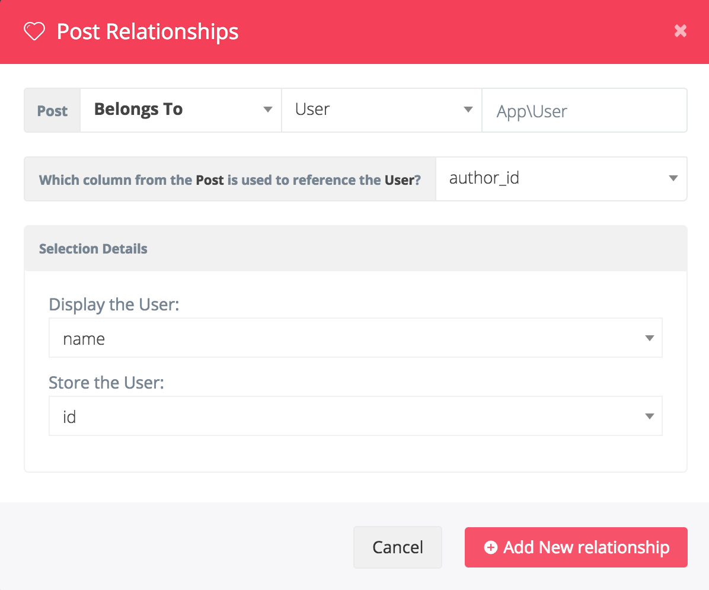

# BREAD Builder

當添加或編輯當前 BREAD 資料表時，您首先會看到 BREAD 資訊，該訊息允許您設置顯示名稱、slug、圖示、模型跟控制器名稱以及策略名稱。

若您需要您也可以選擇是否為 BREAD 類型使用權限管理。


當您往下滑動時可以看到每一行與您的資料庫欄位相關聯，您可以選擇每個欄位在視圖中的 :

* BROWSE \(當您查看當前資料時顯示該欄位\)
* READ \(當您點擊查看當前資料時顯示該欄位\)
* EDIT \(該欄位為可見並且允許您編輯資料\)
* ADD \(當您新增新類型時可看見該欄位\) 
* DELETE \(與刪除無關，因此可以選中或取消選中\)


您可以選擇欄位使用的表單類型，像是文字輸入框、文字區塊、單選、圖片或更多表單元素類型。

每個欄位也可以添加其他詳細訊息或選項，像是複選框、下拉選單、或圖片。

## Additional Field Options

當編輯您的 BREAD 時會有一個文字框允許您為欄位型態編輯額外的訊息及選項。

這個文字框接受 JSON 跟適用於以下類型資料輸入 : 

* Text \(Text Box, Text Area, Rich Textbox and Hidden\)
* Check Box
* Drop Down
* Radio Button
* Image
* Date

以下了解如何使用這些額外訊息 : 

### Text \(Text Box, Text Area, Rich Textbox and Hidden\)

```php
{
    "default" : "Default text"
}
```

Text Box, Text Area, Rich Textbox and Hidden 都是輸入框的類型，在上面的JSON中，您可以指定輸入框的默認值。

### Check Box

```php
{
    "on" : "On Text",
    "off" : "Off Text",
    "checked" : "true"
}
```

在 Voyager 中複選框會被轉換為"切換開關"，正如您看到的那樣，on 鍵將表示切換開關開啟時的值，off 為開關關閉時設置的值。

若 `checked` 設置為 _true_ 則複選框為開啟，否則默認情況下會關閉。

### Drop Down

```php
{
    "default" : "option1",
    "options" : {
        "option1": "Option 1 Text",
        "option2": "Option 2 Text"
    }
}
```

當指定一個輸入框類型為下拉選單時您需要指定該選單的值，在上面的 JSON 中，如果下拉選單沒有值，則可以指定下拉選單的預設值

另外，在選項中您可以在左側指定值以及在右側指定顯示的文字。

### Radio Button

```php
{
    "default" : "radio1",
    "options" : {
        "radio1": "Radio Button 1 Text",
        "radio2": "Radio Button 2 Text"
    }
}
```

單選框與下拉選單完全相同，在沒有值時您可以指定一個預設值給單選框，在選項中您可以在左側指定值以及在右側指定顯示的文字。

### Image

```php
{
    "resize": {
        "width": "1000",
        "height": null
    },
    "quality" : "70%",
    "upsize" : true,
    "thumbnails": [
        {
            "name": "medium",
            "scale": "50%"
        },
        {
            "name": "small",
            "scale": "25%"
        },
        {
            "name": "cropped",
            "crop": {
                "width": "300",
                "height": "250"
            }
        }
    ]
}
```

圖片輸入框有許多選項，預設情況下您沒有設置任何選項是沒問題的，您的圖片仍然可以上傳，但是，如果您想要為上傳的圖片重新調整尺寸，或設置圖片品質，指定縮圖等，您將必須設定這些資訊。

**resize** : 如果您想指定尺寸您將需要填入`resize` 至選項中，如果您同時設定 `height` 及 `width` 為空，則它將根據設置的寬度或高度保持比例。因此，舉例來說，寬度設置為1000像素，並且由於高度設置為 null，因此將圖像寬度調整為1000像素，並根據當前寬高比調整高度 

**quality** : 如果您希望以百分比壓縮圖片，您可以在 `quality` 中設定百分比的值，通常在70%和100%之間對圖片質量沒有影響，但圖片尺寸會明顯降低。

**upsize** : 僅當您將圖像設置為要調整大小時，此選項才有效。如果您指定圖片為 1000 像素而當上傳的圖片小於 1000 像素時，默認情況下，它不會將該圖像提升到1000像素;但是，如果將 `upsize` 設置為 **true**。它會將所有圖像升遷到指定的調整大小值。

**thumbnails** 縮圖為一個陣列對象，每個對象都是創建的新縮圖，每個對象包含 `name` 及 `scale` 兩個百分比的值。該名稱將附加到您的縮略圖圖像（例如，您上傳的圖像是 ABC.jpg，現在將在ABC-medium.jpg 創建一個名為 medium 的縮略圖）。比例是您希望縮略圖縮放的百分比數量。如果指定，此值將是調整大小寬度和高度的百分比。

### Date & Timestamp

```php
{
    "format" : "%Y-%m-%d"
}
```

日期與時間輸入欄位讓您可以設置日期，在 JSON 中您可以指定格式化輸出的日期。它允許您使用 Carbon 的 formatLocalized() 方法在視圖中瀏覽和顯示格式化日期

## Description

所有類型都可以包含說明，以幫助您或其他用戶未來使用 Voyager 管理面板準確了解特定 BREAD 輸入字段的用途，這可以在 Optional Details JSON 輸入字段中定義：

```php
{
    "description": "A helpful description text here for your future self."
}
```

## Validation

在您的 BREAD 中的 _Optional Details_ 每一行內都可以使用簡單的 JSON 指定驗證規則，以下為一個如何添加 _required_ 和 _max length of 12_ 的驗證範例 : 

```php
{
    "validation": {
        "rule": "required|max:12"
    }
}
```

另外，您可能希望添加一些自定義的錯誤訊息，像是 : 

```php
{
    "validation": {
        "rule": "required|max:12",
        "messages": {
            "required": "This :attribute field is a must.",
            "max": "This :attribute field maximum :max."
        }
    }
}
```

從 `v0.10.13` 起您可以使用以下的方式執行 `required` and `max:12` : 

```php
{
    "validation": {
        "rules": [
            "required",
            "max:12"
        ]
    }
}
```

您可以在這邊找到所有可用的驗證規則清單 [Laravel docs](https://laravel.com/docs/validation#available-validation-rules).

## Generating Slugs

使用 BREAD 創建器時您可能希望自動生成某個輸入的 slug，例如您有一些貼文含有標題及 slug，如果要從 title 屬性自動生成 slug，您可以設定以下選項訊息 :

```php
{
    "slugify": {
        "origin": "title",
        "forceUpdate": true
    }
}
```

這將會從 `title` 的輸入欄位中自動產生 slug，如果一個 slug 已經存在，只有在設置了 forceUpdate 的情況下才會更新它，默認情況下這是禁用的。

## Relationships

使用 BREAD 您可以輕易地在資料表建立關聯，您可以在頁面底部看到名為 `建立關聯` 的按鈕。



**Notice**  
如果您還沒有為資料表建立 BREAD，您需要先創建 BREAD，然後你可以在創建 BREAD 之後回來添加關係。否則，您會收到如下通知。



所以您必須要先建立 BREAD 後才可以創建資料表關聯，在您點擊 `建立關聯` 按鈕後，您會看到以下的模型視窗 : 



您將首先指定它將成為哪種類型的關聯，接著您將選擇要引用的表以及屬於該表的 Namespace。然後您將選擇組合這些表的行。

您還可以在下拉選單或多選選單中指定您要的列。

現在您可以輕易地在 Voyager 中直接建立 `belongsTo`, `belongsToMany`, `hasOne`, 和 `hasMany` 的資料表關聯。 

## Tagging


標記讓您在編輯或添加 BREAD 時直接將項目添加到 Belongs-To-Many 關聯內。

您只需要在關聯內簡單的開啟 `Tagging`，即可啟用這個功能。
To activate this function, you simply have to enable `Tagging` in the relationship details


之後您可以在選擇中輸入任意文字，然後按 Enter 鍵保存新關係。


**Be aware:**
這僅儲存 `display-column` ，因此您必須確保所有其他欄位都可以為空或具有默認值。


## Null Values

您可能希望將輸入字段作為 `null` 而非空字符串保存到資料庫中。

簡單來說，在 BREAD 內部，您可以為該字段包含以下可選詳細信息 :

```php
{
    "null": ""
}
```

這會將空至串轉換為一個 `null` 值，但是，您可能希望能夠將空字符串和空值都添加到該資料庫的欄位中。不過，您必須選擇 null 值的替換，它可以是您想要的任何內容。

例如，如果您希望字段將字符串（例如Nothing）更改為空值，則可以包含該字段的以下可選詳細信息：

```php
{
    "null": "Nothing"
}
```

現在輸入 `Nothing` 最終在欄位將會轉換為 `null` 儲存在資料庫中。

## Display options

您還可以使用一些選項來更改 BREAD 的顯示方式。您可以向 json 對象添加顯示鍵並更改特定字段的寬度，甚至可以指定自定義ID。

```php
{
    "display": {
        "width": "3",
        "id": "custom_id"
    }
}
```

這個寬度基於 12-gird 網格系統，設定 width 為 3 則將顯示 25% 寬度。

指定 id 則允許您在元素外產生字定義的包裝器，如 :

```markup
<div id="custom_id">
    <!-- Your field element -->
</div>
```

## Ordering Bread Items

您可以定義瀏覽 BREAD 的默認順序，並通過拖放來排序 BREAD 項目。 為此，您需要先更改 BREAD 的設置：


**Order column** 為資料表中的欄位，該欄位為儲存一個整數。  
**Order display column** 為拖放列表中顯示的欄位  
**Order direction** 欄位的排序方式

在您設置後您可以在 BREAD 頁面中看到 **Order.** 按鈕，

單擊此按鈕將轉到可以重新排列項目的頁面 :


