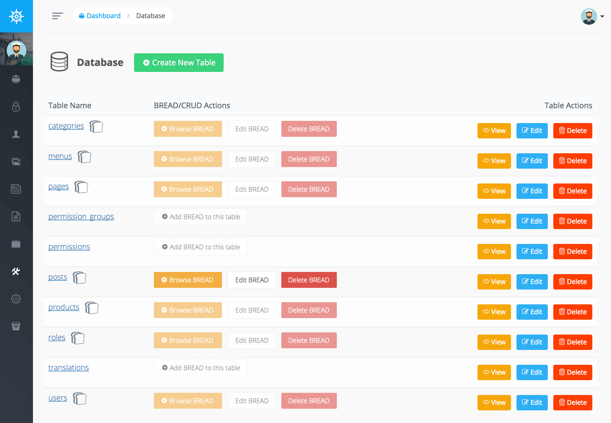

# Database Manager

Voyager 有一些很棒的資料庫工具讓您能添加/編輯/刪除或瀏覽當前資料表頁面。

更棒的部分是您可以添加 BREAD 或 \(Browse, Read, Edit, Add, & Delete\) 功能在任何資料表內。

在管理面板中，您可以訪問工具->數據庫，您將能夠查看數據庫中的所有當前表，您也可以點擊""建立新資料表"在資料庫中創建一張新資料表，
所有新創建的表都將使用您的表中定義的字符集 [默認數據庫連接](https://laravel.com/docs/database#configuration).

如果您點擊資料表名稱您可以查看當前資料表結構，此外，您可以單擊"查看"，"編輯"或"刪除"按鈕以對該表執行該操作。

您也可以選擇對任何資料表添加 BREAD (瀏覽/讀取/編輯/添加/刪除)，一旦資料表有 BREAD  您可以選擇編輯或刪除當前資料表的 BREAD。 

在下一章節中了解更多關於 BREAD 建構器。
