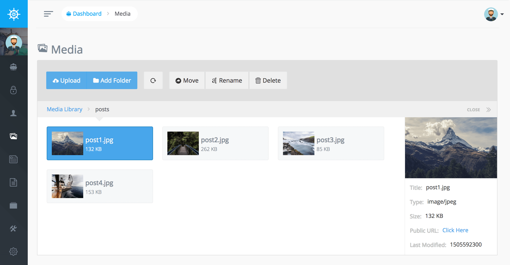

# Media Manager

Voyager 擁有一個完善的媒體管理器讓您上傳及管理您的檔案，您可以新增、移動目錄，基本上您可以在任何類型的媒體管理器中執行任何操作，您可以在 Voyager 媒體管理器中執行此操作

您可以拖拉檔案至上傳按鈕上以及上傳多個檔案


**Notice on File Upload Size**  
當您的上傳時得到檔案過大的錯誤時，這可能是需要在 PHP.ini 中更改的設置。一定要檢查 max_file_upload 和 file_upload_size


