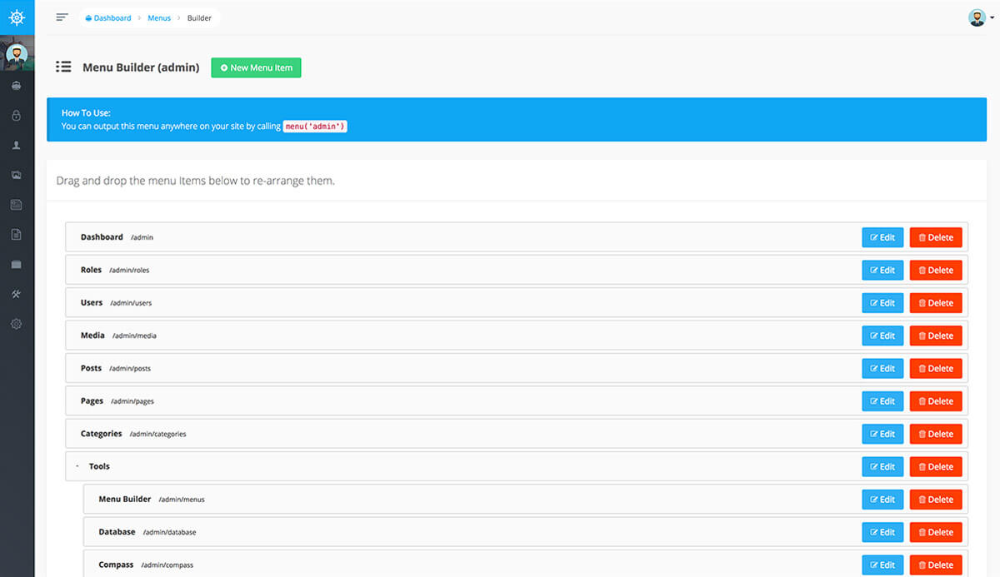

# Menus and Menu Builder

在 Voyager 您可以輕易的為您的應用程式建立選單，事實上 Voyager 管理後台就是使用選單建立器做為左側的選單導航。

您可以透過點擊 _Tools-&gt;Menu Builder_ 按鈕查看當前選單，您可以新增、編輯或刪除任何當前選單，這表示著您可以為網站的標題，側欄或頁腳創建新選單。

當您準備將選單項添加到選單中時，可以點擊相應選單的構建器按鈕：


這將帶您進入選單建立器，您可以在其中添加，編輯和刪除選單項。



在您建立及配置您的選單後，您可以輕易地在應用程式內實現選單，假設我們有一個名為 `main` 的選單。在任何視圖文件中，我們現在可以使用以下代碼輸出選單 :

```php
menu('main');
```

這將會在不包含樣式及排序的的情況下輸出選單，如果您要在應用程式中使用 bootstrap 優化您的樣式，您可以透過在 menu 函式內傳遞第二個參數 bootstrap 對選單進行樣式設置 :  

```php
menu('main', 'bootstrap');
```

接下來，您甚至可以根據需求指定自己的視圖並設置菜單樣式。比如說我們有一個位於 `resources/views/my_menu.blade.php` 的文件，其中包含以下代碼 :

```markup
<ul>
    @foreach($items as $menu_item)
        <li><a href="{{ $menu_item->link() }}">{{ $menu_item->title }}</a></li>
    @endforeach
</ul>
```

接著在任何您想列出選單的地方使用 :

```php
menu('main', 'my_menu');
```

就會輸出您的自訂選單。

### Menu as JSON

如果您不想渲染選單而是獲取數組，則可以將 `_json` 作為第二個參數傳遞。例如 :

```php
menu('main', '_json')
```

那麼您會取得一個 menu-items 的集合。
