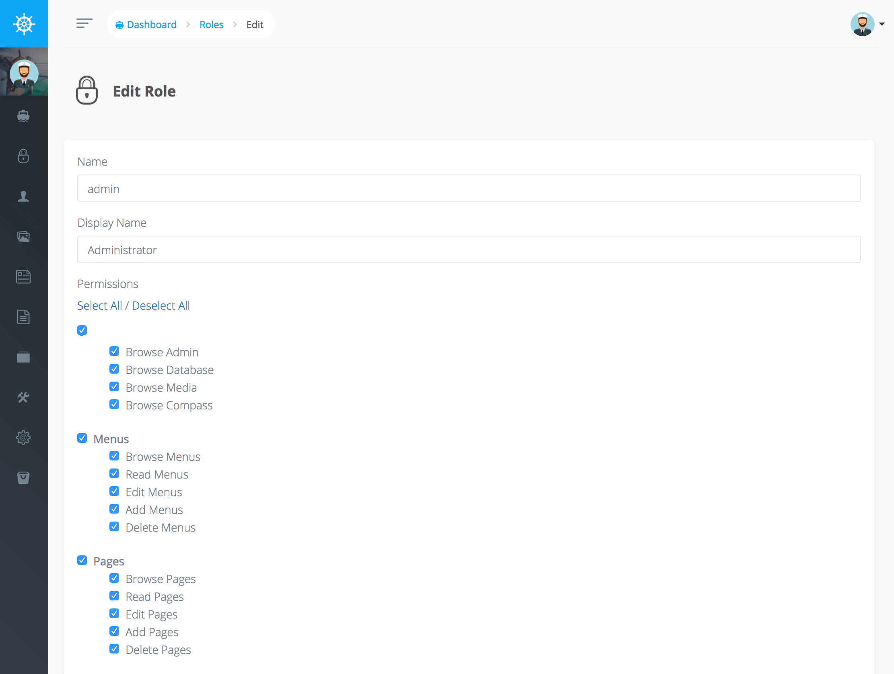

# Roles and Permissions

Voyager 擁有立即可用的"角色(Role)"與"權限(Permissions)"功能，每一個 _user_ 擁有一組擁有權限的角色

在控制台中您可以添加、編輯或刪除當前的角色。此外當您點擊編輯特定的角色您可以指定 BREAD 權限



在 1.0 新版本中我們更換了 Voyager 的授權系統更改為 [more in line with Laravel](https://laravel.com/docs/5.5/authorization#authorizing-actions-using-policies)!

這表示您將可以用以下的方式檢查權限 : 

```php
// via user object
$canViewPost = $user->can('read', $post);
$canViewPost = Auth::user()->can('read', $post);

// via controller
$canViewPost = $this->authorize('read', $post);
```

您還可以選擇使用 Voyager facade 並將權限作為字串傳遞 : 

```php
$canBrowsePost = Voyager::can('browse_posts');
$canViewPost = Voyager::can('read_posts');
$canEditPost = Voyager::can('edit_posts');
$canAddPost = Voyager::can('add_posts');
$canDeletePost = Voyager::can('delete_posts');
```

不論用戶是否包含某些權限，每一次檢查都會回傳一個布林值，如果用戶未含有某些權限您可能還希望拋出一個禁止的異常，這可以透過 `canOrFail` 完成 : 

```php
Voyager::canOrFail('browse_admin');
```

還可以使用以下預設權限 : 

* `browse_admin`: 用戶是否可以瀏覽 Voyager 管理面板。
* `browse_database`: 用戶是否可以瀏覽 Voyager 數據庫選單部分。
* `browse_bread`: 用戶是否可以瀏覽 Voyager BREAD 選單部分。
* `browse_media`: 用戶是否可以瀏覽 Voyager 媒體部分。
* `browse_menu`: 用戶是否可以瀏覽 Voyager 選單部分。
* `browse_settings`: 用戶是否可以瀏覽 Voyager 設置部分。
* `read_settings`: 用戶是否可以查看或查看特定設置。
* `edit_settings`: 用戶是否可以編輯特定設置。
* `add_settings`: 用戶是否可以添加新設置。
* `delete_settings`: 用戶是否可以刪除特定設置。

此外您可以為您建立的 BREAD 類型生成對應的權限 `Generate permissions`，這會建立 `browse`, `read`, `edit`, `add` 和 `delete` 權限。  

舉例來說，或許我們正從 `products` 資料表建立了一個新 BREAD 類型，如果我們選擇為 `products` 資料表建立一個權限，我們的權限鍵名將為 `browse_products`, `read_products`, `edit_products`, `add_products` 和 `delete_products`: 


**Notice**  
如果選單項目與任何類型的 BREAD 相關聯，那麼必須檢查 `browse` 權限，舉例來說，對於 `Posts` BREAD 選單項，它將檢查 `browse_posts` 權限。如果用戶沒有所需的權限，則該選單項將被隱藏。


## Using Permissions in your Blade Template files

您也可以透過視圖語法檢查權限，例如，假設您要檢查用戶是否可以使用 `browse_posts`，我們可以使用以下語法 :

```php
@can('browse', $post)
    I can browse posts
@endcan
```

或者您可能需要執行權限的其他條件，這很簡單:

```php
@can('browse', $post)
    I can browse posts
@else
    I cannot browse posts
@endcan
```


