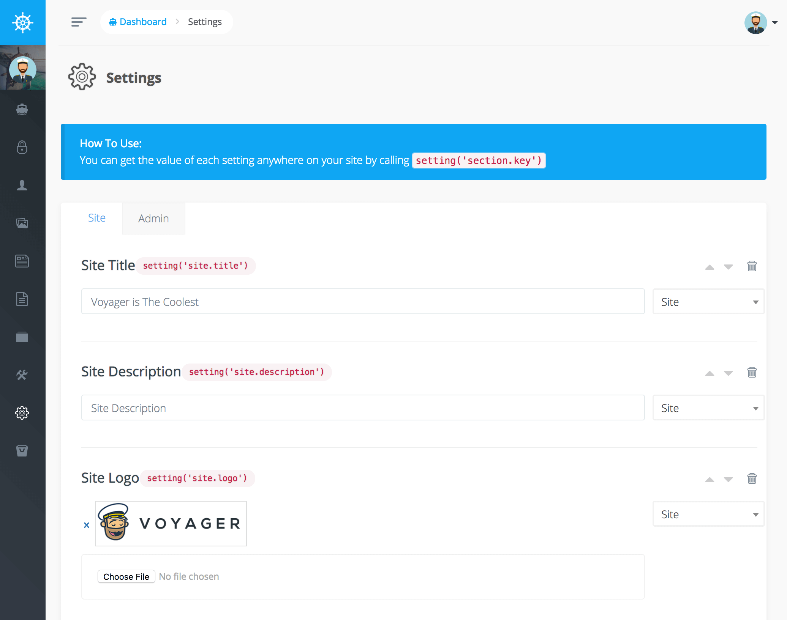

# Settings

設定部分允許您添加任何網站範圍設定。您可以為您的網站上傳 Logo 或在首頁添加文字欄位



在這次的新版本中您還可以為不同設定方式添加群組，所以，如果您在 `site` 組內創建了一個新設置並且它有一個 `title` 鍵，那麼您可以通過執行以下操作在該網站的任何位置引用該設置 :

```php
<?php
echo setting('site.title');
```

或在任何視圖內 : 

```text
{{ setting('site.title') }}
```

您現在可以在 Voyager 添加所有設定並在網站內引用它們。
