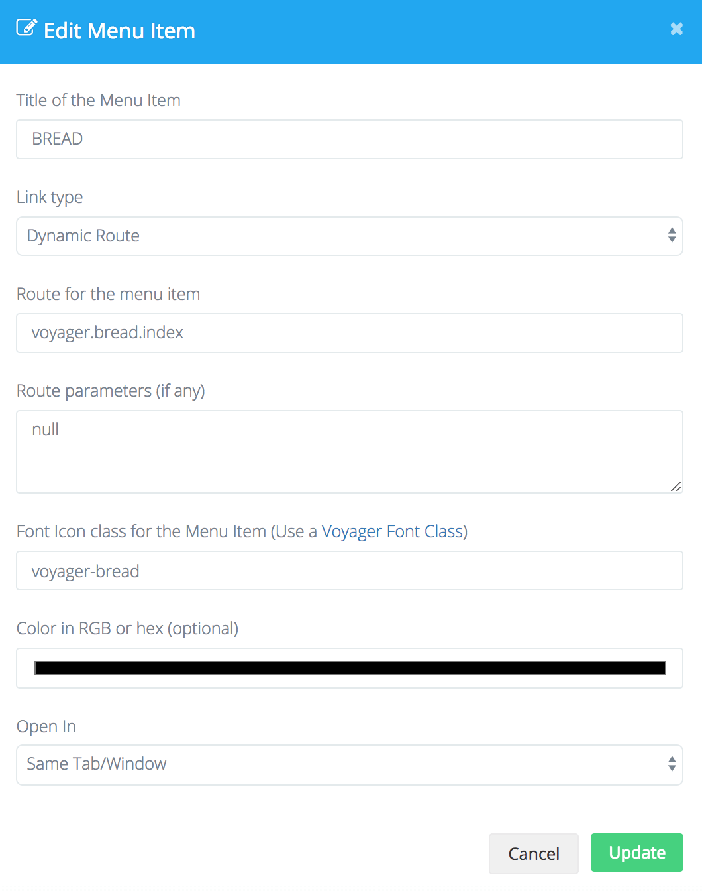

# Upgrading

## 從 1.0 升級至 1.1

### 更新您的 composer.json

要更新至最新版本請先確保 composer.json 中的 voyager 的聲明宣告為 :  

`"tcg/voyager": "1.1.*"`

接著執行 `composer update`

### 執行必要的資料庫資料遷移

您需要執行遷移命令包含在最新版本中所需的新資料表及欄位，您可以在下方找到這些遷移表 :

```text
https://github.com/the-control-group/voyager/blob/1.1/migrations/2017_11_26_013050_add_user_role_relationship.php
https://github.com/the-control-group/voyager/blob/1.1/migrations/2017_11_26_015000_create_user_roles_table.php
https://github.com/the-control-group/voyager/blob/1.1/migrations/2018_03_11_000000_add_user_settings.php
https://github.com/the-control-group/voyager/blob/1.1/migrations/2018_03_14_000000_add_details_to_data_types_table.php
https://github.com/the-control-group/voyager/blob/1.1/migrations/2018_03_16_000000_make_settings_value_nullable.php
```

您可以將這些遷移表放至　`database/migrations`　資料夾下並執行　`php artisan migrate`

### 更新配置 (Configuration)

`voyager.php` 配置文件也有一些調整， 移除 `prefix` 參數並換成 `user.redirect` 參數，請注意 `user.redirect` 參數的值應該總是在最前方加上 \(`/`\)

### 多角色

多角色是v1.1中的新功能，允許您擁有多個角色和一個主要角色。您可以像平常一樣使用此方法獲取用戶的主要角色

```php
$user->role->name // Name of primary role
```

但是現在您還可以使用新的belongsToMany角色關係來獲取所有額外角色

```php
$user->roles() // gets all extra roles relationship
$user->roles()->get() // gets all extra as a collection
```

除此之外，還有一個輔助方法可以獲得所有角色，包括主角色和額外角色：

```php
$user->roles_all() // collection of all roles
```

請注意，您不一定需要使用多角色，並且可以繼續使用主要角色無需進行任何更改。

此外，請確保將新數據行添加到用戶數據類型的數據庫中。在 data_rows 表中插入新的數據行，確保它的 data_type_id 是用戶數據類型的ID，通常這將是ID 3，但更好的是確保它是正確的。

然後確保其他字段如下列所示：

| field | user\_belongstomany\_role\_relationship |
| :--- | :--- |
| type | relationship |
| display\_name | Roles |
| required | 0 |
| browse | 1 |
| read | 1 |
| edit | 1 |
| add | 1 |
| delete | 0 |
| details | `{"model":"TCG\\Voyager\\Models\\Role","table":"roles","type":"belongsToMany","column":"id","key":"id","label":"name","pivot_table":"user_roles","pivot":"1"}` |
| order | 11 |

### BREAD

Voyager 中的 BREAD 及資料庫分為兩個部分，因此為了使用選單訪問 BREAD 部分，請確保添加以下選單項：



然而，您可能仍無法正常運作，因為它還需要權限，接著繼續在 `permissions` 表內建立一個 `key` 為 `browse_bread` 的新欄位並將 `table_name` 設為 `null` 

現在，您應該可以看到 BREAD 選單部分

## 翻譯

> 若您無須翻譯任何 Voyager 字串則可以跳過此步驟

Voyager 已將其翻譯字符串從__（'voyager.generic.close'）更改為以 voyager::group 為前綴。

這表示您需要更新您在 `resources/lang/LOCALE.json` 中的已翻譯字符串以使用新前綴。

## 最後一步

接下來，您可能希望確保擁有所有最新發布的資源，要重新發布 Voyager 資源您可以輸入以下指令

```text
php artisan vendor:publish --tag=voyager_assets --force
```

接著您可能需要透過以下命令清除所有視圖的快取

```text
php artisan view:clear
```


